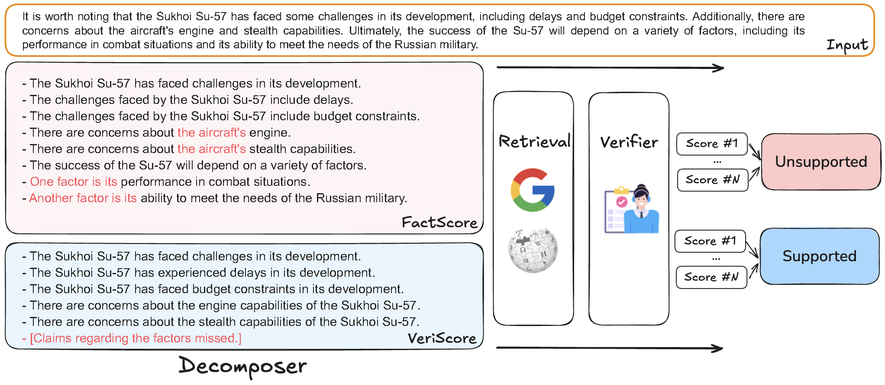

# Decomposition Dilemmas
[](https://arxiv.org/pdf/2411.02400)

This repository provides the source code for the paper: *Decomposition Dilemmas: Does Claim Decomposition Boost or Burden Fact-Checking Performance?* 



## Abstract
Fact-checking pipelines increasingly adopt the **Decompose-Then-Verify** paradigm, where texts are broken down into smaller claims for individual verification and subsequently combined for a veracity decision. While decomposition is widely-adopted in such pipelines, its effects on final fact-checking performance remain underexplored. Some studies have reported improvements from decompostition, while others have observed performance declines, indicating its inconsistent impact. To date, no comprehensive analysis has been conducted to understand this variability. To address this gap, we present an in-depth analysis that explicitly examines the impact of decomposition on downstream verification performance. Through error case inspection and experiments, we introduce a categorization of decomposition errors and reveal a trade-off between accuracy gains and the noise introduced through decomposition. Our analysis provides new insights into understanding current system's instability and offers guidance for future studies toward improving claim decomposition in fact-checking pipelines.


## Data Acquisition
For ClaimDecomp, please refer to the original repository: https://jifan-chen.github.io/ClaimDecomp/

For FELM, please refer to the huggingface page: https://huggingface.co/datasets/hkust-nlp/felm

For WICE and BingChat, please refer to the download script provided by Self-Checker github repository: https://github.com/Miaoranmmm/SelfChecker

## NLI Models (Verifiers)
For AlignScore, we host the model using NeMo Guardrails. Please refer to the official documentation: https://docs.nvidia.com/nemo/guardrails/user_guides/advanced/align-score-deployment.html

For MiniCheck, please refer to the original repository: https://github.com/Liyan06/MiniCheck


## Run experiments
We provide a shell script for running experiments with random combinations of BingChat data. Please refer to `run_test.sh` for more details.

```python
python3 src/pipeline_nli.py \
    --data_dir "./data" \
    --input_dir "./input" \
    --input_file "bingchat_random_combination_3000.json" \
    --output_dir "./output/test" \
    --model_name_extraction "gpt-4o" \
    --model_name_verification "gpt-4o-mini" \
    --decompose_method "specified_number" \
    --specified_number_of_claims 8 \
    --label_n 2 \
    --search_res_num 10 \
    --knowledge_base "google"
```


## Citation
Feel free to cite our paper if you find our insights useful for your research.
```bibtex
@misc{hu2024decompositiondilemmasdoesclaim,
      title={Decomposition Dilemmas: Does Claim Decomposition Boost or Burden Fact-Checking Performance?}, 
      author={Qisheng Hu and Quanyu Long and Wenya Wang},
      year={2024},
      eprint={2411.02400},
      archivePrefix={arXiv},
      primaryClass={cs.IR},
      url={https://arxiv.org/abs/2411.02400}, 
}
```


## Acknowledgement
Our implementation is built upon the [VeriScore](https://github.com/Yixiao-Song/VeriScore) repository and also uses the [FactScore](https://github.com/shmsw25/FActScore) repository. We thank the authors for their great work. We recommend you to check out their repositories for more details as their repositories are good resources to start with.
